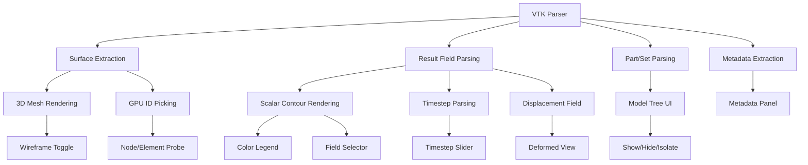

# FEA Viewer — Execution Plan (Step 3, Part A)

> **Scope**: Phased roadmap, feature priorities, test strategy, security, error handling.

---

## 1. Phased Roadmap

### Phase 1 — MVP (12 weeks)

**Goal**: Single-user FEA viewer for VTK/VTU files with scalar contour visualization.

| Week | Milestone | Deliverables |
|---|---|---|
| 1–2 | **Project scaffold & infra** | Monorepo setup, Docker Compose, CI pipeline, hello-world API + frontend. |
| 3–4 | **VTK parser & data model** | VTK/VTU parser (meshio-backed), NodeTable/ElementTable serialization, surface extraction, binary API endpoints. |
| 5–6 | **3D viewer core** | Three.js scene, orbit controls, surface mesh rendering, wireframe toggle, part show/hide. |
| 7–8 | **Result visualization** | Scalar contour rendering (vertex colors + LUT), color legend, field selector, auto-range + user range. |
| 9–10 | **Deformation & timesteps** | Deformed/undeformed toggle, scale factor, timestep slider, lazy field loading. |
| 11 | **Probing & model tree** | GPU ID-picking, node/element info panel, part/set tree, metadata panel. |
| 12 | **Integration, polish, release** | End-to-end tests, performance validation, bug fixes, documentation, deployment to staging. |

**Release criteria (Phase 1)**:
- [x] Upload VTK/VTU → parse succeeds for all test files (see §4).
- [x] Surface mesh renders correctly for TRI3, QUAD4, TET4, HEX8, WEDGE6.
- [x] Scalar contour matches reference values within ε = 1e-6.
- [x] Deformed view: `X_display = X_base + scale * U` verified against known displacement.
- [x] Probe value at node matches source file value exactly (Float64 precision).
- [x] 500K element model renders at ≥ 30 fps on mid-range GPU (e.g., GTX 1660).
- [x] No data-corrupting bugs in parsing, normalization, or rendering.
- [x] All import warnings surfaced to user.

### Phase 2 — Multi-Format & Collaboration (12 weeks)

| Milestone | Deliverables |
|---|---|
| Exodus II + CGNS parsers | New format-specific parsers, same normalized output. |
| Authentication & projects | JWT auth, user accounts, project organization, per-project model list. |
| ODB/OP2 conversion pipeline | Server-side conversion workers (requires solver licenses). |
| Vector glyphs | Arrow rendering for vector fields (displacement, velocity). |
| Section cuts | Interactive clipping plane, dynamic surface re-extraction. |
| Screenshot & PDF export | Client-side canvas capture + server-side PDF generation. |
| Integration-point extrapolation | Extrapolate Gauss-point data to nodes with labeled provenance. |
| Shared view links | Read-only URLs for result sharing. |

**Release criteria (Phase 2)**:
- All Phase 1 criteria still pass.
- Exodus II and CGNS files parse correctly for test suite.
- Auth flow: register, login, create project, upload, share link — all functional.
- 2M element model renders at ≥ 30 fps.
- Extrapolated fields carry visible provenance labels.

### Phase 3 — Advanced (16 weeks)

| Milestone | Deliverables |
|---|---|
| Tensor glyphs | Ellipsoid rendering for stress/strain tensors. |
| Multi-model comparison | Side-by-side or overlay views. |
| Animation export | Client-side MP4/GIF recording of timestep playback. |
| Custom derived fields | User expression engine: `sqrt(S11^2 + S22^2 - S11*S22 + 3*S12^2)`. |
| API access | REST API for CI/CD: upload model, query peak stress, pass/fail. |
| Admin panel | User management, storage quotas, retention policies, audit logs. |

---

## 2. Prioritized Feature List with Dependencies



**Critical path**: VTK Parser → Surface Extraction → 3D Mesh Rendering → Scalar Contour → Deformed View → Probing.

---

## 3. Database & API Contract Recommendations

### 3.1 Database Schema (PostgreSQL)

```sql
CREATE TABLE models (
    id              UUID PRIMARY KEY DEFAULT gen_random_uuid(),
    name            TEXT NOT NULL,
    status          TEXT NOT NULL CHECK (status IN ('uploading','parsing','ready','error')),
    file_format     TEXT,
    file_size_bytes BIGINT,
    raw_file_key    TEXT NOT NULL,          -- S3 key for original file
    node_count      INT,
    element_count   INT,
    metadata        JSONB DEFAULT '{}',    -- Flexible: solver name, version, date, etc.
    unit_system     JSONB DEFAULT '{}',
    warnings        JSONB DEFAULT '[]',
    created_at      TIMESTAMPTZ DEFAULT NOW(),
    updated_at      TIMESTAMPTZ DEFAULT NOW()
);

CREATE TABLE result_fields (
    id              UUID PRIMARY KEY DEFAULT gen_random_uuid(),
    model_id        UUID REFERENCES models(id) ON DELETE CASCADE,
    name            TEXT NOT NULL,
    location        TEXT NOT NULL CHECK (location IN ('nodal','elemental','integration_point')),
    data_type       TEXT NOT NULL CHECK (data_type IN ('scalar','vector3','symmetric_tensor','full_tensor')),
    components      TEXT[] NOT NULL,
    unit            TEXT,
    provenance      JSONB NOT NULL DEFAULT '{}',
    timestep_count  INT NOT NULL DEFAULT 1,
    s3_key_pattern  TEXT NOT NULL           -- e.g., "models/{model_id}/fields/{field_id}/step_{n}.bin"
);

CREATE TABLE named_sets (
    id              UUID PRIMARY KEY DEFAULT gen_random_uuid(),
    model_id        UUID REFERENCES models(id) ON DELETE CASCADE,
    name            TEXT NOT NULL,
    set_type        TEXT NOT NULL CHECK (set_type IN ('node','element')),
    member_count    INT NOT NULL,
    s3_key          TEXT NOT NULL            -- Binary Int32Array of indices
);
```

### 3.2 API Versioning

- All endpoints prefixed with `/api/v1/`.
- Breaking changes require new version (`/api/v2/`).
- Non-breaking additions (new fields) are additive to existing version.

---

## 4. Parsing & Validation Test Strategy

### 4.1 Reference Test Files

| Test File | Elements | Types | Fields | Purpose |
|---|---|---|---|---|
| `single_hex8.vtu` | 1 | HEX8 | displacement (nodal) | Minimal correctness |
| `beam_tet4.vtu` | ~5K | TET4 | stress (elemental), disp (nodal) | Basic beam bending |
| `plate_quad4.vtu` | ~1K | QUAD4 | stress tensor (nodal) | 2D plate |
| `mixed_elements.vtu` | ~2K | TET4+HEX8+WEDGE6 | disp (nodal) | Mixed topology |
| `time_series/` | ~10K | TET4 | disp, stress × 10 steps | Transient |
| `large_model.vtu` | 500K | HEX8 | 3 fields × 1 step | Performance |
| `no_results.vtu` | ~1K | TET4 | None | Geometry-only upload |
| `malformed.vtu` | — | — | — | Error handling |
| `nan_values.vtu` | ~1K | TET4 | stress with NaN | NaN handling |
| `duplicate_ids.vtu` | — | — | — | Reject with error |

### 4.2 Validation Test Matrix

For each test file, verify:
1. Node count matches expected.
2. Element count and types match expected.
3. Connectivity integrity: all node references valid.
4. Result field dimensions match node/element count × components.
5. Surface triangle count within expected range (analytical for simple shapes).
6. Probe values at specific nodes match reference values (Float64 comparison, ε = 1e-12).
7. Warnings generated match expected warnings.
8. Error cases produce correct error messages and HTTP status codes.

### 4.3 Automated Testing

```
pytest tests/parsing/       → unit tests for each parser
pytest tests/validation/     → data model validation tests
pytest tests/api/            → API endpoint integration tests
pytest tests/e2e/            → Playwright tests for full upload-to-render workflow
```

---

## 5. Rendering Correctness Test Strategy

### 5.1 Pixel-Comparison Tests

For known test models with known camera positions:
1. Render scene → capture canvas as PNG.
2. Compare against reference screenshot (SSIM ≥ 0.99).
3. Reference screenshots regenerated only on intentional rendering changes (checked into repo).

### 5.2 Value-Verification Tests

1. Render scalar contour with known min/max.
2. Read pixel color at known node screen position.
3. Reverse-map through LUT → verify reconstructed value within ε of known nodal value.

### 5.3 Deformation Tests

1. Apply known displacement `[1, 0, 0]` to all nodes with scale factor `2.0`.
2. Verify rendered vertex positions = `base + 2.0 * [1, 0, 0]` by reading back vertex buffer.

### 5.4 Performance Tests

Automated via Puppeteer/Playwright:
1. Load 500K element model.
2. Measure time-to-first-render.
3. Orbit continuously for 5 seconds → measure average FPS.
4. Switch field → measure latency.
5. Assert all within performance budget.
